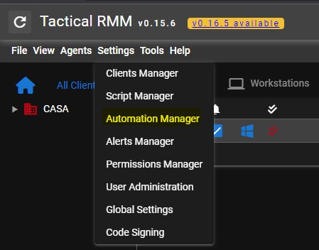
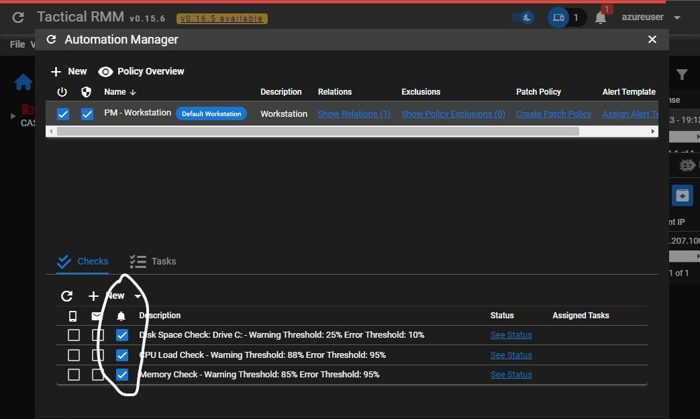
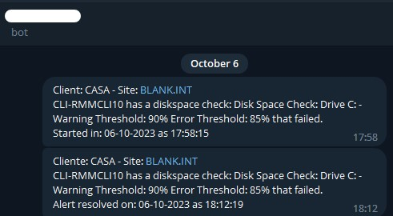

# Summary
<ul>
	<li>
		<strong>
			<a href=#requirements>Requirements</a>
		</strong>
	</li>
	<li>
		<strong>
			<a href=#create-bot-token>Create Bot Token</a>
		</strong>
	</li>
    <li>
		<strong>
			<a href=#get-group-user-telegram-id>Get Group-User Telegram ID</a>
		</strong>
	</li>
	<li>
		<strong>
			<a href=#create-api-key-tactical>Create API-Key Tacticall</a>
		</strong>
	</li>
	<li>
		<strong>
			<a href=#configure-configScrips-ini>Configure configScrips-ini</a>
		</strong>
	</li>
	<li>
		<strong>
			<a href=#manage-systemctl-service>Manage Systemctl Service</a>
		</strong>
	</li>    	
    <li>
		<strong>
			<a href=#configure-alert-dashboard>Configure Alert Dashboard</a>
		</strong>
	</li>
    <li>
		<strong>
			<a href=#telegram-message>Telegram Message</a>
		</strong>
	</li>       
</ul>

# TRMM-TELEGRAM
The idea for this script arose due to the need to quickly visualize an [alert](https://docs.tacticalrmm.com/functions/alerting/) and when it was recovered.

The script works by consulting the Tactical alerts API, where all alerts scheduled to appear on the dashboard (identified by a 'bell') will be sent via Telegram.


The script consumes the alerts endpoint 'https://api.tactical.com/alerts/', where alerts marked "Include snoozed", "Include resolved", 1 day time and all severitys are filtered.


Line 54 on telegram-trmm.py.
```
...
    data = {
        "resolvedFilter": True,
        "snoozedFilter": True,
        "timeFilter": 1,
        "severityFilter": ["error", "warning", "info"]
    }
...
```

All configurations are carried out in the configScrips.ini file and logs are generated and stored in /var/log/trmm-telegram.

This script will check for new alerts every 20 seconds (parameter updateinterval in the configScrips.ini file).

File *sent_alerts.json* is used to control the IDs that are sent and already resolved, a type of database. Whenever an alert is generated in tactical, it is sent by Telegram and stored in 'sent', when this alert is resolved, the script arrives if this alert has already been sent, if it is still in sent, a recovery message is sent in telegram and it is moved to 'resolved' in sent_alerts.json

For Housekeeping control, 100 alert IDs are stored in the *sent_alerts.json* file, this quantity can be configured in the 'max_alerts' parameter in configScrips.ini.

# Requirements:

<b>1 - </b> Tested on Debian 11, Debian 12 or Ubuntu 22.04 LTS <br>
<b>2 – </b> Have installed Python 3.9 (or higher)<br>
<b>3 – </b> Be logged in as root<br>
<b>4 – </b> Run the following commands<br>
<b>5 - </b> Create a Telegram Bot Token <br>

<h3>
Install the packages:
</h3>

<p> Debian/Ubuntu</p> 
<pre>sudo apt-get install -y wget dos2unix git sudo curl bc python3-pip</pre>

<p>Download the installation script</p>
<pre>cd /tmp ; wget https://raw.githubusercontent.com/bernardolankheet/trmm-telegram/main/install.sh -O install.sh ; sudo dos2unix install.sh ; sudo bash install.sh</pre>

# Create Bot Token:

1. Search [BotFather](https://t.me/BotFather) on Telegram.
2. Send /start to get started
3. Send /newbot
4. Enter your Bot name and unique Username, which should end with the bot.
5. Then, you would get your Bot token. (this token you will use on bot_token parameter on configScrips.ini file)

# Get Group-User Telegram ID

This script is prepared to send notifications via User or Group, you can choose which one you want to use.

If you use User:
1. Search [Get ID bot](https://t.me/get_id_bot) on Telegram.
2. Send /my_id to get your id. (this id you will use on user_group_telegram parameter on configScrips.ini file)

If you use Groups:
1. Add [Get ID bot](https://t.me/get_id_bot) in your chat group.
2. Send /my_id to get your id. (this id you will use on user_group_telegram parameter on configScrips.ini file)

# Create API-Key Tactical

1. Login on Tactical;
2. Settings > Global Settings > API KEYS;
3. Click on Boton 'Add Key';
4. Give a name to identify the API Token;
5. Inform a user who wants to link this token;
6. Enter an expiration period (not required);
7. Copy the generated API Key. (this id you will use on alert_api_key parameter on configScrips.ini file)


# Configure configScrips-ini

```
nano /opt/trmm-telegram/configScrips.ini
```

This is an example configuration configScrips.ini
main parameters to be changed: 
* url
* alert_api_key
* bot_token
* user_group_telegram

<pre>
# URL Tacticall (without subdomain rmm. mesh. or api.)
url = rmmtactical.com 
# This a apikey tacticall, Settings > Global Settings > API KEYS
alert_api_key = SVXKKBFOTOVDGU268KSIIWL88W5ZRD123RH 

#Interval in seconds check new alerts.
updateinterval = 10 
#Mumbers of IDs stored in sent_alerts.json file
max_alerts = 100 
# database storage id alerts send and resolved.
sent_alerts_file = /opt/trmm-telegram/sent_alerts.json 

# Telegram Bot Token, used https://t.me/BotFather
bot_token = 181768159672:AnsHUYgdyioLIWOt_9R24G-c9lYuwwaVeEDPKo 
# Telegram group/user ID to receive messages, used https://t.me/myidbot
user_group_telegram = 150157059
</pre>

***Note: after changing the configScrips.ini file, the service is required.***

# Manage Systemctl Service:

Manage service: 
```
# stop
systemctl stop trmm-telegram.service
# start
systemctl start trmm-telegram.service
# restart
systemctl restart trmm-telegram.service
# status
systemctl restart trmm-telegram.service
```

# Configure Alert Dashboard:

An easy way to select which alerts will be used for notification is to use Automation Manager, where we will define which checks will generate Alerts on the Dashboard and the script will consume them to notify.


Settings > [Automation Manager](https://docs.tacticalrmm.com/functions/automation_policies/)




Configure your checks to Alerts Dashboard.




# Telegram Message

This a final result.


